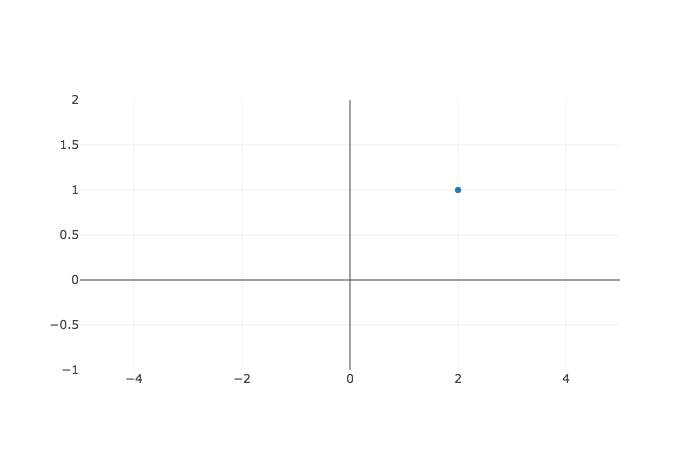

# Visualizing Data with Graphs

### Learning Objectives

* Understand the components of a point in a graph, an $x$ value, and a $y$ value 
* Understand how to plot a point on a graph, from a point's $x$ and $y$ value
* Get a sense of how to use a graphing library, like Plotly, to answer questions about our data

### A common problem

Imagine that Molly is selling cupcakes out of her kitchen.  Things are beginning to pick up, and so, she decides to hire her friend Bob to make deliveries.  Molly asks us -- seeing us as a go to problem solver -- to figure out which customers are closest and furthest from Bob.  This way, she can compensate him -- and let's be honest, monitor his performance --  appropriately.

Molly gives us a list of all of the customer locations, along with Bob's.  Here they are:

| Name | Avenue #| Block # | 
|------|------| ------     |
| Bob    | 4  |     8     | 
| Suzie  | 1  |     11     | 
| Fred   | 5  |     8     | 
| Edgar  | 6  |     13     | 
| Steven | 3  |     6     | 
| Natalie| 5  |     4     | 

Now to figure out is who is closest to Bob you decide to make a graph of each customer's locations, as well as Bob's, in a graph.

### Visualizing Data with Graphs

We want to ease into graphing data, so let's start off with a scatter plot of just one random point, the point $(2, 1)$.



Ok so that graph above is our first introduction to the **cartesian coordinate system**.  The coordinate system is used to display data along both an x-axis and y-axis.  The **x-axis** runs horizontally, from left to right, and you can see it as the labeled gray line along the bottom.  The **y-axis** runs vertically, from the bottom to the top.  You can see it labeled on the far left of our graph.

Our graph may show the x-axis starting at -4 and the y-axis starting at -1, but that's just the graph.  In reality, you can imagine the x-axis and y-axis both including all numbers from negative infinity to positive infinity.  And that marker in the center of our graph represents the point where $x = 2 $ and $y = 1$.  Do you see why?  Well it's the place where the $x$ value is $2$, and the $y$ value is $1$.  As a shorthand, we mathematicians express this point as $(2, 1)$.  The format is $(x, y) $, with the $x$ coordinate always coming first.

There are light-gray lines forming a grid on the graph to help us see where any given **point** is on a graph.  Now, test your knowledge by moving your mouse to the point $(4, 2)$.  Did you get it?  It's the spot at the top right of the graph.

### Plotting our data

Ok, now let's plot the data given.  


| Name | Avenue #| Block # | 
|------|------| ------     |
| Bob    | 4  |     8     | 
| Suzie  | 1  |     11     | 
| Fred   | 5  |     8     | 
| Edgar  | 6  |     13     | 
| Steven | 3  |     6     | 
| Natalie| 5  |     4     | 


We cannot graph the data with python itself, so we need to download a library from the internet.  This is easy enough.  Simply go to your terminal and type in `pip install plotly` followed, by the enter key.  Or you can press shift enter on the cell below.  If you already have `plotly` installed, you will see a message saying that it's already installed -- which you can safely ignore.


```python
!pip install plotly
```

Now we have `plotly` on our computer.  The next step is to get it into this notebook.  We do so with the following two lines.


```python
import plotly

plotly.offline.init_notebook_mode(connected=True)
# use offline mode to avoid initial registration
```


<script>requirejs.config({paths: { 'plotly': ['https://cdn.plot.ly/plotly-latest.min']},});if(!window.Plotly) {{require(['plotly'],function(plotly) {window.Plotly=plotly;});}}</script>


We bring in the `plotly` library by using the keyword `import` followed by our library name, `plotly`.  We create new dictionary in python with the `dict` constructor.  Then we pass through **named arguments** to the constructor to create a dictionary with an `x` key that points to an array of $x$ values.  Similarly, we create a `y` key with a value of an array of $y$ values. Note that the $x$ values match avenue numbers and the $y$ values match the block numbers.  We display this data by assigning our dictionary to the variable of `trace0`, and passing it through as an argument to the `plotly.offline.iplot` method.  


```python
trace0 = dict(x=[4, 1, 5, 6, 3, 2], y=[8, 11, 8, 13, 6, 4])

# All that, and it doesn't even look good :(
plotly.offline.iplot([trace0])
```


<div id="b3d96e38-ac22-49d2-a5ea-0f81a1d59caf" style="height: 525px; width: 100%;" class="plotly-graph-div"></div><script type="text/javascript">require(["plotly"], function(Plotly) { window.PLOTLYENV=window.PLOTLYENV || {};window.PLOTLYENV.BASE_URL="https://plot.ly";Plotly.newPlot("b3d96e38-ac22-49d2-a5ea-0f81a1d59caf", [{"x": [4, 1, 5, 6, 3, 2], "y": [8, 11, 8, 13, 6, 4]}], {}, {"showLink": true, "linkText": "Export to plot.ly"})});</script>


The points were plotted correctly, but they are connected by a line, which doesn't represent anything in particular.

Let's remove the lines by setting `mode = "markers"`.  Then, let's also set labels to each of the dots, by setting `text` equal to an array of our names.  


```python
trace1 = dict(x=[4, 1, 5, 6, 3, 2],
              y=[8, 11, 8, 13, 6, 4], 
              mode="markers", 
              text=["bob", "suzie", "fred", "edgar", "steven", "natalie"],)


plotly.offline.iplot([trace1])

# much better :)
```


<div id="d46f853c-0243-4540-8171-7f902e9ffa77" style="height: 525px; width: 100%;" class="plotly-graph-div"></div><script type="text/javascript">require(["plotly"], function(Plotly) { window.PLOTLYENV=window.PLOTLYENV || {};window.PLOTLYENV.BASE_URL="https://plot.ly";Plotly.newPlot("d46f853c-0243-4540-8171-7f902e9ffa77", [{"x": [4, 1, 5, 6, 3, 2], "y": [8, 11, 8, 13, 6, 4], "mode": "markers", "text": ["bob", "suzie", "fred", "edgar", "steven", "natalie"]}], {}, {"showLink": true, "linkText": "Export to plot.ly"})});</script>


Ok, so if you move your mouse over the dots, you can see the names that correspond to each point.  Also, when we hover over the dot at the x axis of point four, we can see that is Bob's point, just like it should be.  Now, who is closest to Bob?  It looks like Fred is, so that is the delivery that is easiest for Bob.

### Summary

In this section, we saw how we use data visualisations to better understand the data.  A cartesian coordinate system nicely represents two dimensional data.  It allows us to represent a point's $x$ value by placing the point horizontally at the correct spot on the x-axis.  It represents a point's $y$ value by placing the point at the correct spot along the y-axis.

To display the data with `plotly` we need to do a couple of things.  First, we install plotly by going to our terminal and running `pip install plotly`.  Then to use the library, we import the `plotly` library into our notebook.  Once the library is loaded in our notebook, it's time to use it.  We create a new dictionary with keys of $x$ and $y$, with each key pointing to an array of the $x$ or $y$ values of our points.  To clean up the appearance we set the `mode` attribute equal to `'markers'`.
